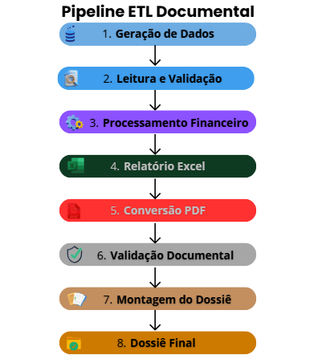
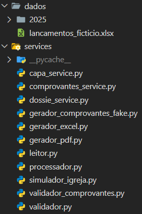
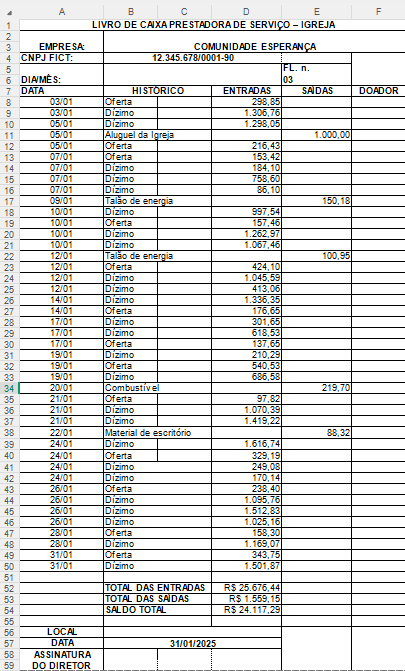
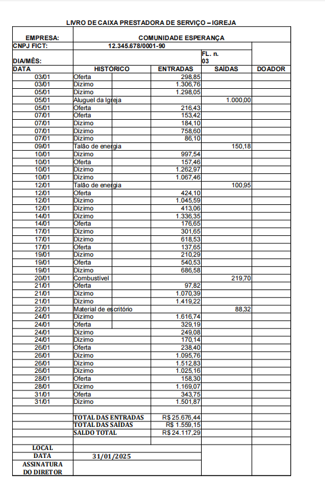
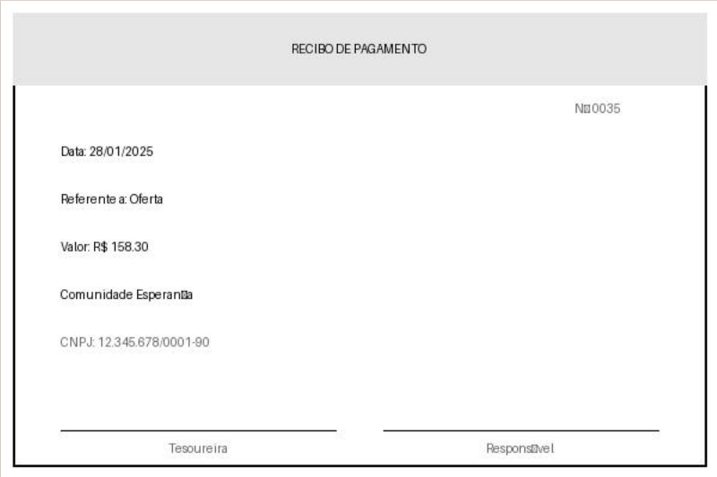
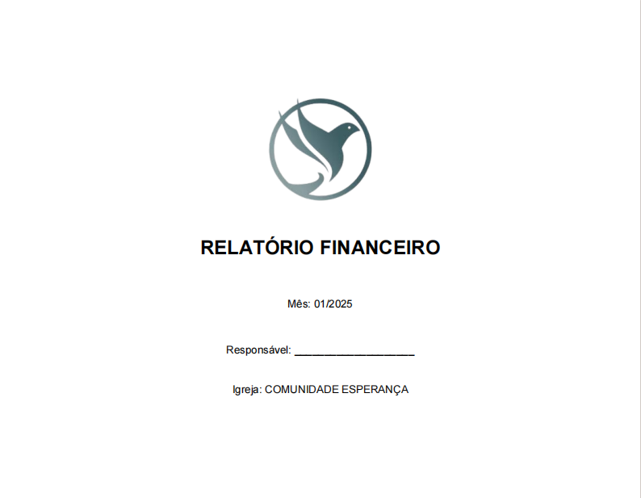

# Nonprofit Financial Report Automation


Sistema de automação de relatórios financeiros desenvolvido para simular um fluxo real de prestação de contas mensal de uma organização sem fins lucrativos.

O projeto automatiza desde a geração dos lançamentos financeiros até a montagem completa do dossiê mensal em PDF, incluindo validação de comprovantes, organização documental e exportação para integração contábil.

---

## Destaque

- Sistema inspirado em operação real de tesouraria
- Fluxo validado em ambiente operacional
- Estrutura modular orientada a serviços
- Integração Excel → PDF automatizada
- Compátivel com fluxo contábil real

---

## Sobre o projeto

Este projeto nasceu da necessidade de automatizar um processo operacional real de tesouraria que exigia horas de trabalho manual todos os meses.

A solução foi inspirada em um sistema utilizado em ambiente real e adaptada para um ambiente fictício, permitindo demonstração técnica pública sem exposição de dados sensíveis.

O sistema simula um fluxo completo de gestão documental financeira, incluindo:

- geração de lançamentos financeiros fictícios
- processamento e validação de dados
- geração automatizada de relatórios
- organização de comprovantes
- montagem de dossiê mensal completo
- exportação em Excel e PDF

O foco do projeto não está apenas na geração de arquivos, mas na construção de um pipeline modular, validável e próximo de um cenário operacional real.

---

## Cenário simulado

O projeto simula o fluxo operacional de prestação de contas mensal de uma organização sem fins lucrativos, incluindo:

- Tesouraria
- Organização documental
- Auditoria básica
- Prestação de contas
- Integração contábil
- Validação de comprovantes

Todo o fluxo foi estruturado para se aproximar de um ambiente operacional real.

---

## Demonstração Visual

### Pipeline ETL Documental

Visão geral do fluxo automatizado do sistema, desde a geração dos dados financeiros até a montagem final do dossiê mensal.

<p align="center">
  
</p>

---

### Estrutura do Projeto

Organização modular do sistema seguindo separação de responsabilidades.

<p align="center">
  
</p>

---

### Relatório Financeiro em Excel

Relatório estruturado automaticamente para integração contábil.

<p align="center">
  
</p>

---

### Relatório Oficial em PDF

Versão final em PDF gerada automaticamente pelo pipeline.

<p align="center">
  
</p>

---

### Comprovantes Financeiros

Comprovantes organizados e vinculados automaticamente aos lançamentos financeiros.

<p align="center">
  
</p>

---

### Dossiê Final Consolidado

Documento final montado automaticamente contendo:
- capa personalizada
- relatório financeiro
- comprovantes anexados
- organização mensal completa

<p align="center">
  
</p>

---

## Funcionalidades

### Geração de dados financeiros fictícios

- Simulação de entradas e saídas financeiras
- Sazonalidade mensal
- Valores variáveis controlados
- Categorias financeiras configuráveis
- Fluxo financeiro inspirado em comportamento real

### Processamento de dados

- Leitura automatizada da planilha principal
- Normalização de colunas
- Tratamento de dados inconsistentes
- Conversão e validação de datas
- Consolidação mensal

### Geração de comprovantes fictícios

- Geração automatizada de comprovantes PNG
- Organização por mês
- Nomeação padronizada
- Associação por ID de lançamento

### Geração de relatórios

- Relatório Excel formatado
- Conversão automática para PDF
- Integração com LibreOffice headless
- Template padronizado

### Validação documental

- Verificação de comprovantes faltantes
- Auditoria de consistência
- Alertas detalhados por lançamento

### Montagem de dossiê

- Capa personalizada
- Relatório financeiro
- Anexação automática de comprovantes
- PDF final consolidado

---

## Arquitetura do projeto

O sistema foi estruturado com separação de responsabilidades para facilitar manutenção, escalabilidade e evolução futura.

```bash
nonprofit-financial-report-automation/
├── assets/
│   └── logo.png
│
├── config/
│   └── regras_igreja.py
│
├── dados/
│   ├── lancamentos_ficticio.xlsx
│   └── 2025/
│       ├── 01/
│       │   └── comprovantes/
│       ├── 02/
│       │   └── comprovantes/
│       └── ...            
│
├── services/
│   ├── simulador_igreja.py
│   ├── leitor.py
│   ├── processador.py
│   ├── gerador_excel.py
│   ├── validador.py
│   ├── gerador_pdf.py
│   ├── comprovantes_service.py
│   ├── gerador_comprovantes_fake.py
│   ├── validador_comprovantes.py
│   ├── capa_service.py
│   └── dossie_service.py
│
├── templates/
│   └── template_relatorio.xlsx
│
├── utils/
│   └── datas.py
│
├── gerar_dados_ficticios.py
├── gerar_comprovantes_ficticios.py
├── main.py
├── requirements.txt
└── README.md
```

---

## Tecnologias utilizadas

### Backend e processamento

- Python
- Pandas
- openpyxl

### Documentos e PDFs

- ReportLab
- PyPDF2
- Pillow
- LibreOffice Headless

### Estrutura e automação

- ETL modular
- Processamento de arquivos
- Organização documental automatizada

---

## Fluxo do sistema

```bash
1. Geração dos lançamentos financeiros fictícios
        ↓
2. Criação automática dos comprovantes
        ↓
3. Leitura e validação dos dados
        ↓
4. Processamento financeiro mensal
        ↓
5. Geração do relatório Excel
        ↓
6. Conversão automática para PDF
        ↓
7. Validação de comprovantes
        ↓
8. Montagem do dossiê final
```

---

## Diferenciais técnicos

- Arquitetura modular baseada em separação de responsabilidades
- Simulação financeira com sazonalidade
- Pipeline automatizado de documentos
- Integração Excel → PDF
- Validação automatizada de inconsistências
- Organização documental orientada por data e ID
- Estrutura preparada para evolução futura

---

## Aprendizados do projeto

Durante o desenvolvimento foram trabalhados conceitos como:

- Modelagem de fluxo financeiro
- Automação documental
- ETL em Python
- Tratamento de inconsistências
- Geração de PDFs
- Organização de pipelines
- Debugging de sistemas reais

**Aprendizado técnico em destaque – parsing de datas:**

Durante o debugging do sistema, foi identificado um bug silencioso causado pelo parâmetro `dayfirst=True` no `pd.to_datetime()`.

O problema não quebrava o sistema – os arquivos eram gerados normalmente – mas invertia mês e dia em datas no formato `YYYY-MM-DD`, fazendo lançamentos caírem no mês errado e comprometendo toda a lógica de processamento mensal.

A solução foi remover o parâmetro, já que o formato `YYYY-MM-DD` é interpretado corretamente pelo pandas por padrão. O `dayfirst=True` só faz sentido para datas no formato `DD/MM/YYYY`.

Esse bug levou 5 dias de investigação sistemática para ser identificado – e evidencia a importância de validar o parsing de datas antes de qualquer processamento.

---

## Melhorias futuras

- Envio automático do dossiê por e-mail
- Dashboard analítico em Power BI
- API para consulta dos relatórios
- Armazenamento em banco de dados
- Interface web administrativa
- Logs estruturados
- Testes automatizados

---

## Como executar

### 1. Clone o repositório

```bash
git clone https://github.com/marinizedev/nonprofit-financial-report-automation.git 
cd nonprofit-financial-report-automation
```

### 2. Crie o ambiente virtual

```bash
python -m venv .venv
```

### 3. Ative o ambiente virtual

**Windows**

```bash
.venv\Scripts\activate
```

**Linux/Mac**

```bash
source .venv/bin/activate
```

### 4. Instale as dependências

```bash
pip install -r requirements.txt
```

### 5. Configure o arquivo `.env`

Crie um arquivo `.env` na raiz do projeto baseado no `.env.example`:

```bash
# Windows
LIBREOFFICE_PATH=C:\Program Files\LibreOffice\program\soffice.exe

# Linux
LIBREOFFICE_PATH=/usr/bin/soffice

# Mac
LIBREOFFICE_PATH=/Applications/LibreOffice.app/Contents/MacOS/soffice
```

> O LibreOffice precisa estar instalado no sistema para a conversão de Excel para PDF funcionar.

### 6. Gere os dados fictícios

```bash
python gerar_dados_ficticios.py
```

> Esse script gera a planilha de lançamentos fictícios necessária para o sistema.

### 7. Execute o sistema

```bash
python main.py
```

> O sistema irá processar os dados, gerar os comprovantes, relatórios, validar a documentação e montar o dossiê mensal completo.

---

# Autora

**Marinize Santana** — Estudante de Análise e Desenvolvimento de Sistemas com foco em Engenharia de Dados e Analytics.

Desenvolvendo soluções orientadas por problemas reais, com foco em automação, dados e arquitetura modular.